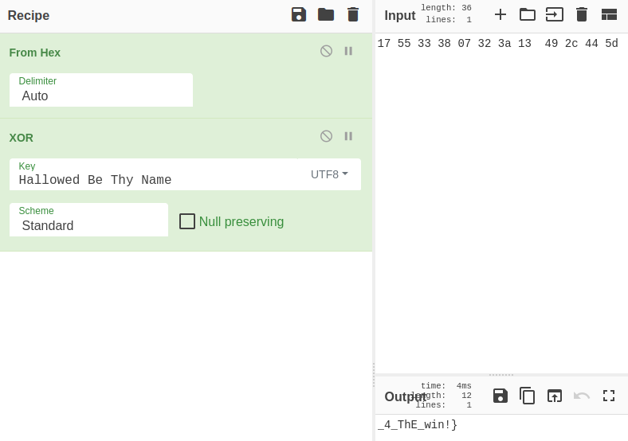

# Badge Challenge 2
## Synopsis
User [credmp](https://github.com/credmp) created a badge Challenge and therefore used steganography methods. Files and text were hidden in a `PNG` file.
The url is provided trough a QR code which could be scanned at the HTB meetup of 2022/12/21 (y/m/d/).

These hints were given during the challenge by user credmp.

1. looking for a pass phrase
2. The image contains 3 elements; something you will need at the end, something you can osint and something within. If there are no solves by Sunday I will provide a Christmas hint.


## :scroll: TL:DR :scroll:
Find the flag in a `png` file with steganography methods.
tools used:
1. kali linux
2. hexdump:   `hexdump -C -n 8 79586af7a20d63e149b0852dfa076139-challenge.png`
3. OSINT `google` setlist phrase `Hallowed Be Thy Name`
4. pngcheck : `pngcheck -v 79586af7a20d63e149b0852dfa076139-challenge.png` 12 bytes after IEND
5. zsteg:  `zsteg -a -v encoded-inner.png`
6. stegosuite v0.8.0-2
7. cyberchef or python3: `XOR` the hex `17 55 33 38 07 32 3a 13  49 2c 44 5d` with the text `Hallowed Be Thy Name`.


## :rocket: Getting Started :rocket:
First we create a folder and we download this image:
![[79586af7a20d63e149b0852dfa076139-challenge]](../img/79586af7a20d63e149b0852dfa076139-challenge.png)
```sh
mkdir badge2
wget https://arjenwiersma.nl/c/2/79586af7a20d63e149b0852dfa076139-challenge.png
```


## Part :one:
what file are we looking at?
With a tool like `hexdump` we can find the magic bytes of the file. We can use  tools like `file` instead. 

```sh
hexdump -C -n 8 79586af7a20d63e149b0852dfa076139-challenge.png
```
hexdump output: it seems to be a PNG file.
```sh
00000000  89 50 4e 47 0d 0a 1a 0a                           |.PNG....|
00000008
```

### stegosuite
Stegonagrafy is a method to hide something in an image, this could be text, audio files, other images or scripts.

For this challenge we need to download a specific [stegosuite](http://ftp.de.debian.org/debian/pool/main/s/stegosuite/stegosuite_0.8.0-2_all.deb) version 0.8.0-2 and install it `dpkg -i stegosuite_0.8.0-2_all.deb`.


We need a phrase for `stegosuite`  and therefore we need a little bit of OSINT.

#### OSINT
if we OSINT, read google, "Iron Maiden Wacken 2016" we can find a setlist that is played on Wacken in 2016 trough Iron Maiden:
```txt

Doctor Doctor
(UFO song)
Play Video
If Eternity Should Fail
Play Video
Speed of Light
Play Video
Children of the Damned
Play Video
Tears of a Clown
Play Video
The Red and the Black
Play Video
The Trooper
Play Video
Powerslave
Play Video
Death or Glory
Play Video
The Book of Souls
Play Video
Hallowed Be Thy Name
Play Video
Fear of the Dark
Play Video
Iron Maiden
Play Video
Encore:
The Number of the Beast
Play Video
Blood Brothers
Play Video
Wasted Years
(followed by 'Happy Birthday'… more )
Play Video
Song played from tape

(Monty Python song) 
```

Manually we can try the whole list typing in stegosuite or write a bruteforce script to do so.
For me this worked as followed:
1. Always Look on the Bright Side of Life
2. Hellowed by the name

The second phrase is a :dart:.
```sh
stegosuite -d -x  79586af7a20d63e149b0852dfa076139-challenge.png -k "Hallowed Be Thy Name"
```
result in  an `encoded-inner.png` that is created.

Now we can found the first part of the challenge using `zsteg`:
```sh
zsteg -a -v encoded-inner.png
```
output:
```sh
BADGE{St3gan0graphy
```


## Part :two:

a `pngcheck` leads to additional data after `IEND chunk`
```sh
pngcheck -v 79586af7a20d63e149b0852dfa076139-challenge.png
```
output:
- additional data after IEND chunk

With `steg -a -v` we find  
```sh
steg -a -v 79586af7a20d63e149b0852dfa076139-challenge.png                                                                                                                                                                                             
[?] 12 bytes of extra data after image end (IEND), offset = 0x20e50c                                                                                                                                                                                       
extradata:0         .. 
```
a hex after IEND
```sh
17 55 33 38 07 32 3a 13  49 2c 44 5d
```
or in ascii text:

```sh
.U38.2:.I,D]
```

solving the second part could be done trough cyberchef or a `pyton3` script `badge.py`:

### Firstly the python way 2 go
the previous founded hex `17 55 33 38 07 32 3a 13  49 2c 44 5d` is used as a key and the string `"Hallowed Be Thy Name"`.
The script was provided by user MrHaas.
```py
key = bytes.fromhex("17 55 33 38 07 32 3a 13  49 2c 44 5d")
track = b"Hallowed Be Thy Name"

print("".join(chr(a ^ b) for a, b in zip(track, key)))
```
If we run this script like so:
```sh
pyton3 badge.py
```
it compiles the 2nd part:
```sh
_4_ThE_win!}

```


### Secondly the cyberchef way to go
input :  `17 55 33 38 07 32 3a 13  49 2c 44 5d`
recipe:
1. from hex auto
2. XOR with key: Hallowed Be Thy Name `UTF8`

  

## Wrap it up!
output:
```sh
BADGE{St3gan0graphy_4_ThE_win!}
```


## :old_key:NOTES: 

### :mortar_board: Lessens learned
1. do re-use collected wordlists
2. XOR use a key instead of always bruteforce 
3. Check your software versions. 
4. Set a timer :hourglass:, and get out your :rabbit:hole!

### out of scope :bowtie:
Where `79586af7a20d63e149b0852dfa076139` does look odd for a name of an image we could have checked it.
Which I actually did. :warning: this was one of my :rabbit:holes!

a check with `hashid 79586af7a20d63e149b0852dfa076139` results in a possible MD5 hash.
with `hascat` and a wordlist like `rockyou.txt` you might crack the hash.

```shell
hashcat -m 0 hash /usr/share/wordlists/rockyou.txt
```


